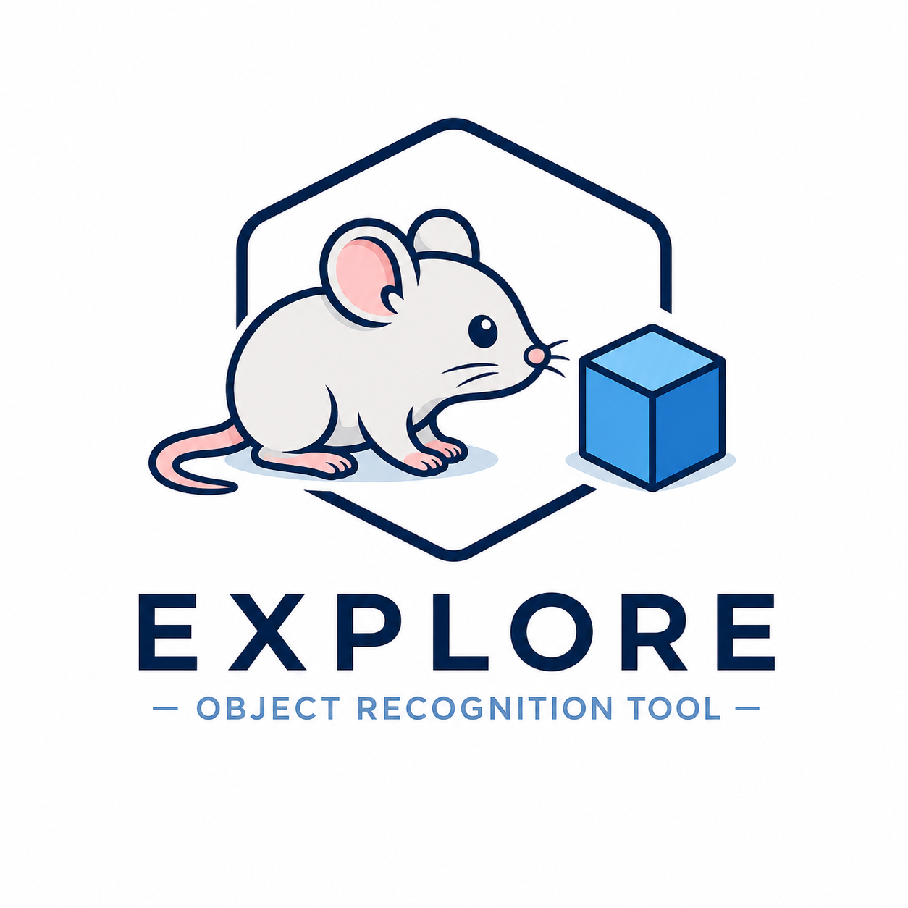

<p align="center">
  
</p>

**Automated exploration behavior analysis for object recognition and location tests**  
*CLIP-based classification with an iterative labeling loop — no GPU required.*

[](https://github.com/victorjonathanibanez/EXPLORE/actions)
[](https://pypi.org/project/explore/)
[](https://pypi.org/project/explore/)
[](LICENSE)

---

## Overview

EXPLORE analyzes rodent object exploration from overhead video recordings.
It uses CLIP (ViT-B/32) to classify frames and a lightweight logistic-regression
head that you train interactively in a few minutes — no GPU, no manual frame
labeling spreadsheet.

**Core workflow (browser GUI):**

1. Add videos and name your project
2. Draw bounding boxes around each object on a reference frame
3. Verify that boxes are correctly re-localized across all videos
4. Sample 1-minute windows, correct proximity-based labels, train the classifier
5. Run the full analysis — annotated videos, exploration CSVs, trajectory plots

---

## Installation

```bash
# 1. Install PyTorch (CPU)
pip install torch torchvision --index-url https://download.pytorch.org/whl/cpu

# 2. Install EXPLORE
pip install explore
```

For GPU (CUDA 12):
```bash
pip install torch torchvision --index-url https://download.pytorch.org/whl/cu121
pip install explore
```

---

## Quick start

### GUI (recommended)

```bash
explore gui
```

The browser app opens automatically. Work through the six tabs in order:

| Tab | What you do |
|-----|-------------|
| **1. Project** | Enter a project name, choose an output folder, add video files |
| **2. Label Objects** | Get a reference frame from any video; draw a bounding box around each object and name it |
| **3. Verify Boxes** | ORB feature matching re-localizes boxes across all other videos; drag any box to correct it |
| **4. Label Frames** | Sample 1-minute windows → proximity labels applied automatically → correct wrong labels → *Train + Preview* to fit the classifier and preview the next window with model predictions. Repeat until labels look right. |
| **5. Analyze** | Set min bout duration; toggle DI/RI (computed for every object pair); choose low-res (fast) or high-res prediction video; click **Run** |
| **6. Results** | Browse the results table; output files are in your project folder |

Session state is saved automatically at each step — use **Load project** on Tab 1
to resume from where you left off.

---

### Python API

```python
from explore import ExperimentConfig, ExplorationPipeline
from explore.config import AnalysisConfig, BehaviorConfig, ModelConfig, ObjectConfig

cfg = ExperimentConfig(
    project_name="NOR_cohort_A",
    project_path="/data/experiments",
    video_paths=["/data/videos/animal_01.mp4"],
    video_duration_minutes=5,
    objects=[
        ObjectConfig(name="familiar", bounding_box=(120, 80, 320, 280)),
        ObjectConfig(name="novel",    bounding_box=(600, 80, 800, 280)),
    ],
    behavior=BehaviorConfig(
        exploration_prompts=[
            "a mouse actively sniffing and investigating an object",
            "a rodent with nose close to an object, exploring it",
        ],
        no_exploration_prompts=[
            "a mouse walking away from or ignoring objects",
            "a rodent resting or grooming away from objects",
        ],
    ),
    model=ModelConfig(),
    analysis=AnalysisConfig(compute_di=True),
)

pipeline = ExplorationPipeline(cfg, headless=True)
results = pipeline.run()
print(results)
```

---

## Output files

| File | Description |
|------|-------------|
| `results/<project>.csv` | Tidy per-animal, per-minute table: exploration time, frequency, DI and RI for every object pair |
| `results/prediction_videos/*.mp4` | Annotated video at 12 fps / half resolution (low-res mode) with coloured overlays at exploration moments |
| `results/tracking/<video>_tracking.csv` | Animal centroid (x, y) per analysis frame |
| `results/tracking/<video>_trajectory.png` | Trajectory plot colour-coded by time with object boxes overlaid |
| `model/head.pkl` | Fitted logistic-regression head (~5 kB, shareable across experiments) |
| `session.json` | Full project state — reopen any session with *Load project* in the GUI |
| `config.yaml` | Experiment configuration including behavioral prompts |

### DI and RI

Discrimination Index and Recognition Index are computed for **every pair** of
objects when *Compute DI / RI* is enabled. With objects `A` and `B`:

```
DI_A_vs_B = (t_A − t_B) / (t_A + t_B)
RI_A_vs_B = t_A / (t_A + t_B)
```

Values are based on total session exploration time (not per-bin), which avoids
instability from empty time bins.

---

## How the classifier works

1. **Zero-shot baseline** — CLIP text prompts score every frame without any
   labeled data. This is the starting point if you skip Tab 4.
2. **Iterative fine-tuning** — Tab 4 samples 1-minute windows at ~4 fps.
   Proximity to each object's bounding box provides initial labels. You correct
   any mistakes, then click *Train + Preview*: a logistic-regression head is
   fitted on CLIP embeddings of all saved windows, and the next window is
   immediately predicted by the new model. Each round adds ~240 frames to the
   training pool. Typically 3–5 rounds (~15 minutes) are sufficient.
3. **Balanced training** — The logistic-regression head uses
   `class_weight="balanced"` to handle the natural skew toward
   *not exploring* frames.
4. **Analysis** — `pipeline.run()` embeds all frames at 4 fps and classifies
   them with the trained head (or zero-shot if no head was fitted).

---


## Development

```bash
git clone https://github.com/victorjonathanibanez/EXPLORE
cd EXPLORE

pip install torch torchvision --index-url https://download.pytorch.org/whl/cpu
pip install -e ".[dev]"

# Run tests (no GPU, no model download)
pytest -m "not slow and not gpu"

# Lint + format
ruff check src/ tests/
ruff format src/ tests/
```

---

## Contributing

Pull requests welcome. Areas where contributions are most valuable:

- New behavioral templates (validated on published datasets)
- Pose estimation integration for more robust tracking
- Better object assignment when multiple objects are very close together
- Windows-specific testing

Please open an issue before submitting large changes.

---

## License

MIT — see [LICENSE](LICENSE).

---

## Citation

If you use EXPLORE in your research, please cite:

> Ibañez, V., Bohlen, L., Manuella, F. et al. EXPLORE: a novel deep learning-based analysis method for exploration behaviour in object recognition tests. Sci Rep 13, 4249 (2023). https://doi.org/10.1038/s41598-023-31094-w

---

## Contact

**Victor Ibañez** — victor.ibanez@uzh.ch  
**Anna-Sophia Wahl** — AnnaSophia.Wahl@med.uni-muenchen.de  
